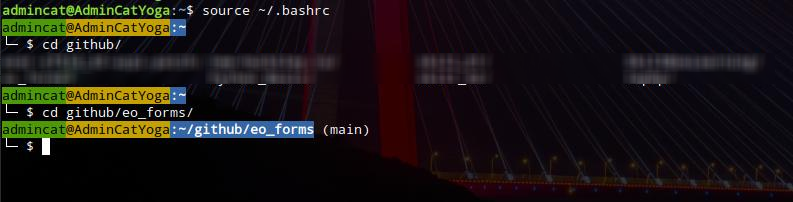

# Useful commands and scripts for operating systems 

## Useful linux scripts

### Docker
#### Cron-driven docker build cache cleaner for gitlab-runner (not only, actually)
From time to time docker build cache becomes a problem which uses 100% of disk space. [This script](linux/docker/docker_builder_cache_cleaner.sh) need to be added to cron, from where it will be see if there is a few space left. If disk have less space then 10% free - it will prune docker build cache.
Every time it runs - it write log to /var/log/messages

### Scripts
#### Script to reconnect OpenVPN
Before you may use this script - make sure you have openvpn server and .ovpn config, you need login and password as well.
Then you have to install openvpn app:
```
sudo apt update && sudo apt install openvpn
```
if you have not debian-like distro - you know what to do, if not - just search the web.
After you have it all - place [this script](linux/scrits/openvpn_reconnector.sh) in some folder and pray. LoL
Just joking. Place the file, edit three first variables (you can edit whole file, of course) and make the _cron job_ to run this script once in a while, but not more often then its' inner workaround.


### Samba
#### AD and domain membership
- If you need to clean all samba database files (if you're experimenting with AD membership in samba)[clean_all_bd script](linux/samba/ad/clean_all_bd.sh)
- to add your Samba server to AD first - save your own smb.conf, nsswitch.conf, krb5.conf
	
	```bash
	mkdir smb_backup
	sudo mv /etc/samba/smb.conf ./smb_backup/smb.conf.$(date +"%Y-%m%-%d").bak
	sudo mv /etc/nsswitch.conf ./smb_backup/nsswitch.conf.$(date +"%Y-%m%-%d").bak
	sudo mv /etc/krb5.conf ./smb_backup/krb5.conf.$(date +"%Y-%m%-%d").bak
	```
	use [this smb.conf](linux/samba/ad/smb.conf) as a sample.
	
---	

### bash

#### awesome bash input string (zsh+PowerLevel10K-like)
To make your bash looks awesome you don't need to use zsh with 10K stories (I know, it's powerfull and handy, but if the point only in good-looking then why?)
open your .bashrc file with your favorite editor (I bet - it's vim!) and change the PS1 string to look like this:
```bash
PS1='${debian_chroot:+($debian_chroot)}\[\033[42m\033[02;30m\]\u\033[43m@\h\[\033[00m\]\[\033[01;44m\]:\w\[\033[00m\]$(__git_ps1)\n└─ $ '
```
then save it and run the command:
```bash
source ~/.bashrc
```
It will be represented like this:



yeah, it also shows a git branch if the directory is a git repository

---

## Windows

### Backup rotation for MS SQL

- this [script](windows/backup_rotation.bat) is running through directories and copy .bak files in directories of base, year and month. Backups should be on D: in Backups subfolders. .bak files in Backups directory will not be copied (my developers use them as temporary backups)

